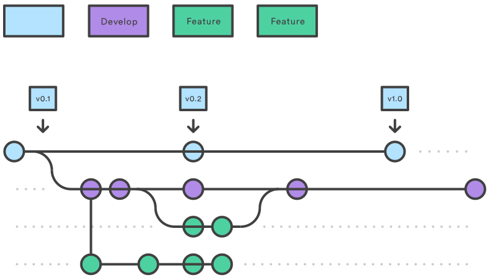

# Mathias Bosman - online resume

## About

A simple website with a bit of GitHub magic containing my personal resume
on [mathiasbosman.be][link_mathiasbosman_be].

## Development

### Local development
A simple `npm install` should be enough to get started.
Once dependencies are installed `npm run dev` will spin up the website locally.
The terminal will tell you which local address is used.
For example:
```shell
  VITE v4.4.3  ready in 126 ms

  ➜  Local:   http://localhost:5173/
  ➜  Network: use --host to expose
  ➜  press h to show help
```

Follow the 'feature branches' Git workflow:


1. make sure the `development` branch contains the latest state
2. create a feature branch from the `development` branch
3. make your changes and create a pull request into the `development` branch

### Testing

3 types of testing are active:
1. Unit tests
3. Component tests
2. End-2-end tests

Unit and component tests are run on each push.
In addition, end-2-end tests are run on pull requests.

#### Unit testing
[Vitest][link_vitest] is used for unit testing and can be run by running the below npm script:
```shell
npm run test:unit
```

#### Component testing
Components are tested via [Cypress][link_cypress]:
```shell
npm run test:component
```

#### End to end
These are also run with [Cypress][link_cypress].
For end-2-end tests the application should be running:

```shell
npm run dev
npm run test:e2e
```

## Deployment

The master branch will automatically be deployed via [Netlify][link_netlify].
Every pull request against the master branch will deploy a preview app.
[Netlify][link_netlify] will comment on the PR with the relevant links.

## Credits

### Frameworks and libraries

-   [Lit][link_lit]
-   [Tailwindcss][link_tailwind]
-   [Vite][link_vite]
-   [Cypress][link_cypress]

[link_mathiasbosman_be]: http://mathiasbosman.be
[link_lit]: https://lit.dev/
[link_tailwind]: https://tailwindcss.com/
[link_cypress]: https://cypress.io
[link_netlify]: https://netlify.com
[link_vite]: http://vitejs.dev
[link_vitest]: http://vitest.dev
